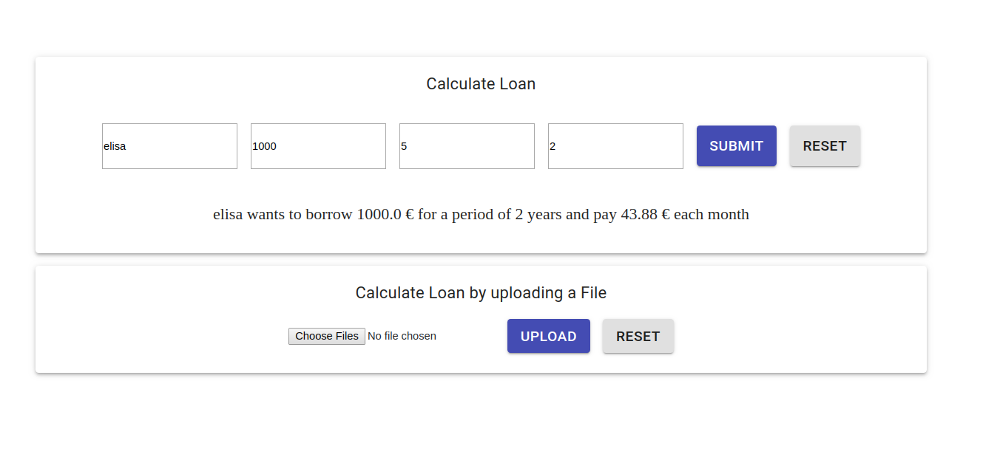
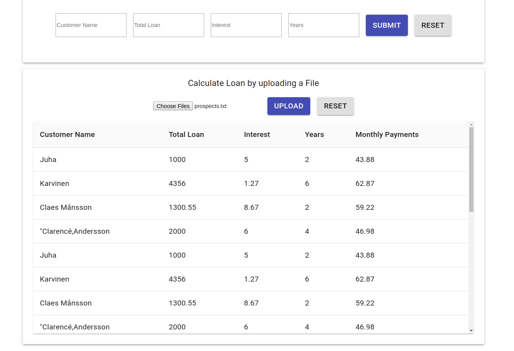

# Mortage plan
Calculating monthly payment for mortgage loan

## Getting Started

To install this application, run the following commands:

```bash
git clone https://github.com/Ufatima/cross-bank-mortage-plan.git
cd cross-bank-backend
```
### With Yarn
```bash
$ yarn start
```
the app runs on http://localhost:3000





## Try it out!
This site was built using [AWS amplify](https://master.d38owettqxfauy.amplifyapp.com/)
